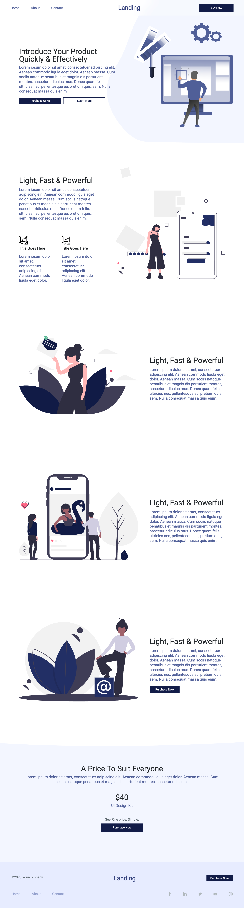

# Responsive Figma-to-Bootstrap Website

A fully responsive website built with **HTML, CSS, and Bootstrap**, based on a Figma design.  
The project demonstrates **pixel-perfect implementation**, responsive layouts, and Bootstrap best practices.

## Features
- Fully responsive across desktop, tablet, and mobile  
- Pixel-perfect implementation of a Figma design  
- Built with Bootstrap 5 (grid system, utilities, components)  
- Clean, consistent layout and typography  

## Preview 


## How to Run
1. Clone the repo:
   ```bash
   git clone https://github.com/hareem-rana/bootstrap-webpage.git
2. Open landing_page.html in your browser.

## Credits

* [Figma Website Template - Landing Page (Free) (Community) (Community)](https://www.figma.com/community/file/1299730473127955218/figma-website-template-landing-page-free-community-community) published by ivana yoh
* Licensed under [CC BY 4.0](https://creativecommons.org/licenses/by/4.0/)
* Modifications: adapted into a responsive website using HTML, CSS, and Bootstrap
## License

This project is licensed under the MIT License.
